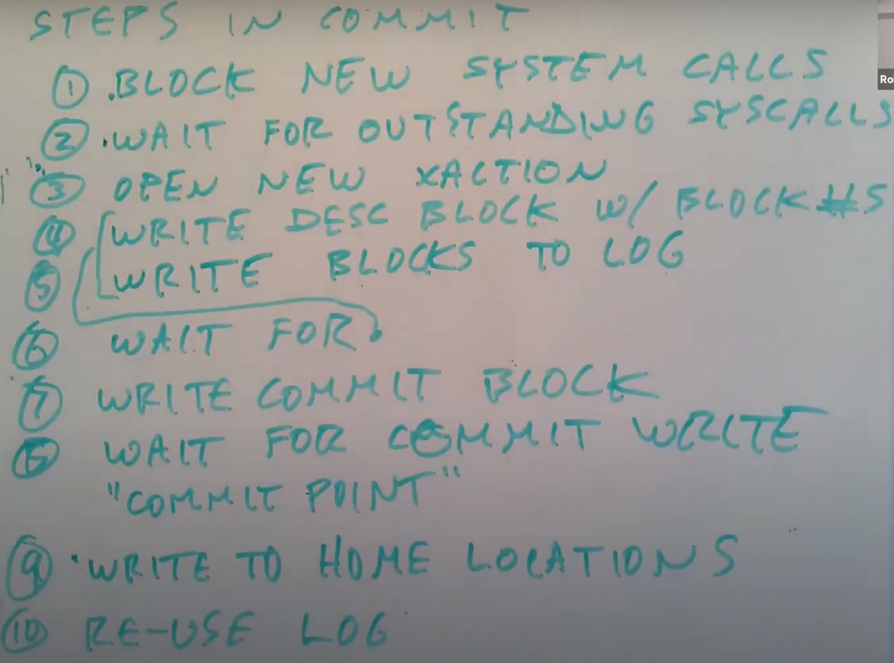

# 16.6 ext3 transaction commit步骤

基于上面的系统调用的结构，接下来我将介绍commit transaction完整的步骤。每隔5秒，文件系统都会commit当前的open transaction，下面是commit transaction涉及到的步骤：

1. 首先需要阻止新的系统调用。当我们正在commit一个transaction时，我们不会想要有新增的系统调用，我们只会想要包含已经开始了的系统调用，所以我们需要阻止新的系统调用。这实际上会损害性能，因为在这段时间内系统调用需要等待并且不能执行。
2. 第二，需要等待包含在transaction中的已经开始了的系统调用们结束。所以我们需要等待transaction中未完成的系统调用完成，这样transaction能够反映所有的写操作。
3. 一旦transaction中的所有系统调用都完成了，也就是完成了更新cache中的数据，那么就可以开始一个新的transaction，并且让在第一步中等待的系统调用继续执行。所以现在需要为后续的系统调用开始一个新的transaction。
4. 还记得ext3中的log包含了descriptor，data和commit block吗？现在我们知道了transaction中包含的所有的系统调用所修改的block，因为系统调用在调用get函数时都将handle作为参数传入，表明了block对应哪个transaction。接下来我们可以更新descriptor block，其中包含了所有在transaction中被修改了的block编号。
5. 我们还需要将被修改了的block，从缓存中写入到磁盘的log中。之前有同学问过，新的transaction可能会修改相同的block，所以在这个阶段，我们写入到磁盘log中的是transaction结束时，对于相关block cache的拷贝。所以这一阶段是将实际的block写入到log中。
6. 接下来，我们需要等待前两步中的写log结束。
7. 之后我们可以写入commit block。
8. 接下来我们需要等待写commit block结束。结束之后，从技术上来说，当前transaction已经到达了commit point，也就是说transaction中的写操作可以保证在面对crash并重启时还是可见的。如果crash发生在写commit block之前，那么transaction中的写操作在crash并重启时会丢失。
9. 接下来我们可以将transaction包含的block写入到文件系统中的实际位置。
10. 在第9步中的所有写操作完成之后，我们才能重用transaction对应的那部分log空间。

