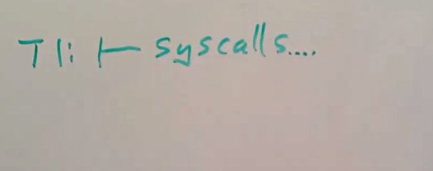

# 16.8 为什么新transaction需要等前一个transaction中系统调用执行完成

以上就是ext3中相对来说直观的部分。实际上还有一些棘手的细节我想讨论一下。之前我提到过，ext3中存在一个open transaction，但是当ext3决定要关闭该transaction时，它需要等待该transaction中的所有系统调用都结束，之后才能开始新的transaction。假设我们现在有transaction T1，其中包含了多个系统调用。

