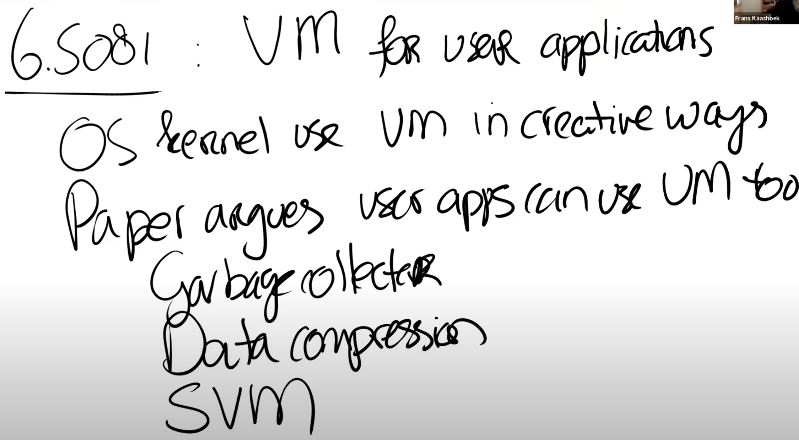

# 17.1 应用程序使用虚拟内存所需要的特性

今天的话题是用户应用程序使用的虚拟内存，它主要是受这篇1991年的[论文](https://pdos.csail.mit.edu/6.828/2020/readings/appel-li.pdf)的启发。

首先，你们已经知道了，操作系统内核以非常灵活的方式使用了虚拟内存Page Table。你们已经通过Lazy Allocation Lab，Copy on Write Lab，以及XV6中的各种内存实现了解到了这一点。而今天论文中的核心观点是，用户应用程序也应该从灵活的虚拟内存中获得收益，也就是说用户应用程序也可以使用虚拟内存。用户应用程序本身就是运行在虚拟内存之上，我们这里说的虚拟内存是指：User Mode或者应用程序想要使用与内核相同的机制，来产生Page Fault并响应Page Fault（注，详见Lec08，内核中几乎所有的虚拟内存技巧都基于Page Fault）。也就是说User Mode需要能够修改PTE的Protection位（注，Protection位是PTE中表明对当前Page的保护，对应了4.3中的Writeable和Readable位）或者Privileged level。今天的论文，通过查看6-7种不同的应用程序，来说明用户应用程序使用虚拟内存的必要性。这些应用程序包括了：

* Garbage Collector
* Data Compression Application
* Shared Virtual Memory

