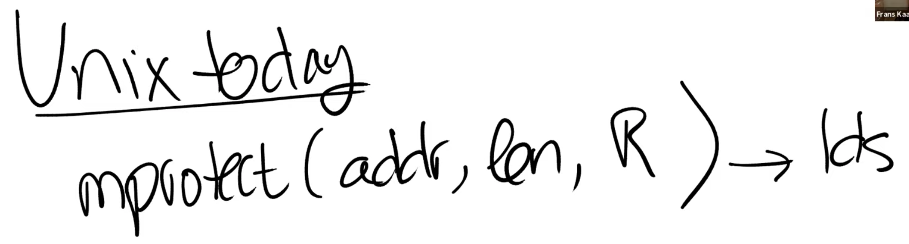

# 17.2 支持应用程序使用虚拟内存的系统调用

第一个或许也是最重要的一个，是一个叫做mmap的系统调用。它接收某个对象，并将其映射到调用者的地址空间中。举个例子，如果你想映射一个文件，那么你需要将文件描述符传递给mmap系统调用。mmap系统调用有许多令人眼花缭乱的参数（注，mmap的具体说明可以参考[man page](https://man7.org/linux/man-pages/man2/mmap.2.html)）：

* 第一个参数是一个你想映射到的特定地址，如果传入null表示不指定特定地址，这样的话内核会选择一个地址来完成映射，并从系统调用返回。
* 第二个参数是想要映射的地址段长度len。
* 第三个参数是Protection bit，例如读写R|W。
* 第四个参数我们会跳过不做讨论，它的值可以是MAP\_PRIVATE。它指定了如果你更新了传入的对象，会发生什么。（注，第四个参数是flags，MAP\_PRIVATE是其中一个值，在mmap文件的场景下，MAP\_PRIVATE表明更新文件不会写入磁盘，只会更新在内存中的拷贝，详见[man page](https://man7.org/linux/man-pages/man2/mmap.2.html)）。
* 第五个参数是传入的对象，在上面的例子中就是文件描述符。
* 第六个参数是offset。

）。当你将某个对象映射到了虚拟内存地址空间，你可以修改对应虚拟内存的权限，这样你就可以以特定的权限保护对象的一部分，或者整个对象。

。

 中实现的一个系统调用，不属于标准Unix 接口），在sigalarm中可以设置每隔一段时间就调用handler。sigaction也可以实现这个功能，只是它更加的通用，因为它可以响应不同类型的signal。

> 学生提问：看起来mprotect暗示了你可以为单独的地址添加不同的权限，然而在XV6中，我们只能为整个Page设置相同的权限，这里是有区别吗？
>
> Frans教授：不，这里并没有区别，它们都在Page粒度工作。如果你好奇的话，有一个单独的系统调用可以查看Page的大小。

如果你回想前面提到过的虚拟内存特性，我们可以将它们对应到这一节描述的Unix接口中来。

* trap对应的是sigaction系统调用
* Prot1，ProtN和Unprot可以使用mprotect系统调用来实现。mprotect足够的灵活，你可以用它来修改一个Page的权限，也可以用它来修改多个Page的权限。当修改多个Page的权限时，可以获得只清除一次TLB的好处。
* 查看Page的Dirty位要稍微复杂点，并没有一个直接的系统调用实现这个特性，不过你可以使用一些技巧完成它，我稍后会介绍它。
* map2也没有一个系统调用能直接对应它，通过多次调用mmap，你可以实现map2特性。

或许并不完全受这篇论文所驱动，但是内核开发人员已经在操作系统中为现在的应用程序提供了这些特性。接下来，我将在框架层面简单介绍一下这些特性是如何实现的，之后再看看应用程序是如何使用这些特性。
