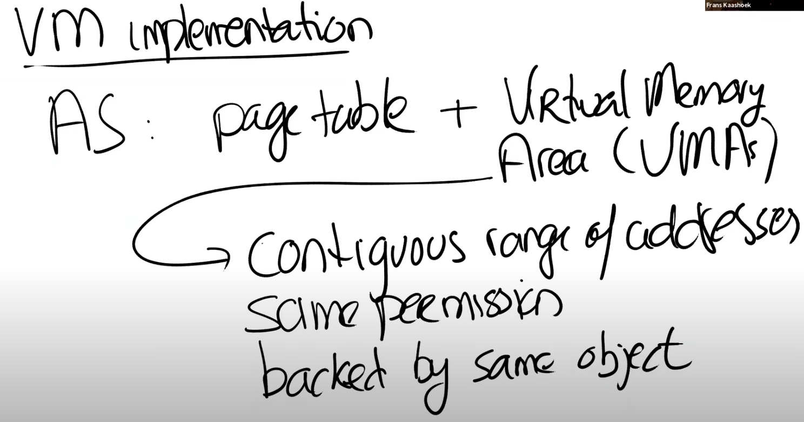

# 17.3 虚拟内存系统如何支持用户应用程序

有关实现，有两个方面较为有趣。

第一个是虚拟内存系统为了支持这里的特性，具体会发生什么？这里我们只会讨论最重要的部分，并且它也与即将开始的mmap lab有一点相关，因为在mmap lab中你们将要做类似的事情。在现代的Unix系统中，地址空间是由硬件Page Table来体现的，在Page Table中包含了地址翻译。但是通常来说，地址空间还包含了一些操作系统的数据结构，这些数据结构与任何硬件设计都无关，它们被称为Virtual Memory Areas（VMAs）。VMA会记录一些有关连续虚拟内存地址段的信息。在一个地址空间中，可能包含了多个section，每一个section都由一个连续的地址段构成，对于每个section，都有一个VMA对象。连续地址段中的所有Page都有相同的权限，并且都对应同一个对象VMA（例如一个进程的代码是一个section，数据是另一个section，它们对应不同的VMA，VMA还可以表示属于进程的映射关系，例如下面提到的Memory Mapped File）。

