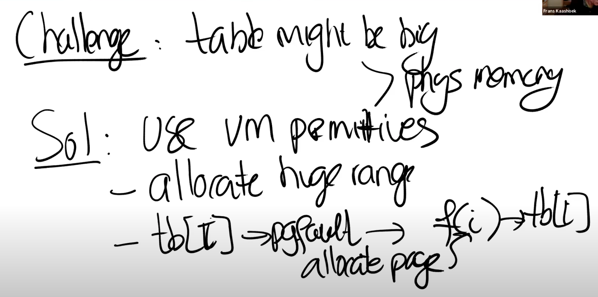

# 17.4 构建大的缓存表

接下来，我将通过介绍几个例子来看一下如何使用之前介绍的内容。我会从一个非常简单的例子开始，之后我们会看一下Garbage Collector，因为很多同学都问了Garbage Collector的问题，所以GC是一个可以深入探讨的好话题。

首先我想讨论的是一个非常简单的应用，它甚至都没有在论文中提到，但它却是展示这节课的内容非常酷的一个方法。这个应用里是构建一个大的缓存表，什么是缓存表？它是用来记录一些运算结果的表单。举个例子，你可以这么想，下面是我们的表单，它从0开始到n。表单记录的是一些费时的函数运算的结果，函数的参数就是0到n之间的数字。

的结果是什么时，你需要做的就是查看表单的i槽位，并获取f(i)的值。这样你可以将一个费时的函数运算转变成快速的表单查找，所以这里一个酷的技巧就是预先将费时的运算结果保存下来。如果相同的计算需要运行很多很多次，那么预计算或许是一个聪明的方案。

，并将结果存储于tb\[i]，也就是表单的第i个槽位，最后再恢复程序的运行。

这种方式的优势是，如果你需要再次计算f(i)，你不需要在进行任何费时的计算，只需要进行表单查找。即使接下来你要查找表单的i+1槽位，因为一个内存Page可能可以包含多个表单项，这时也不用通过Page Fault来分配物理内存Page。

