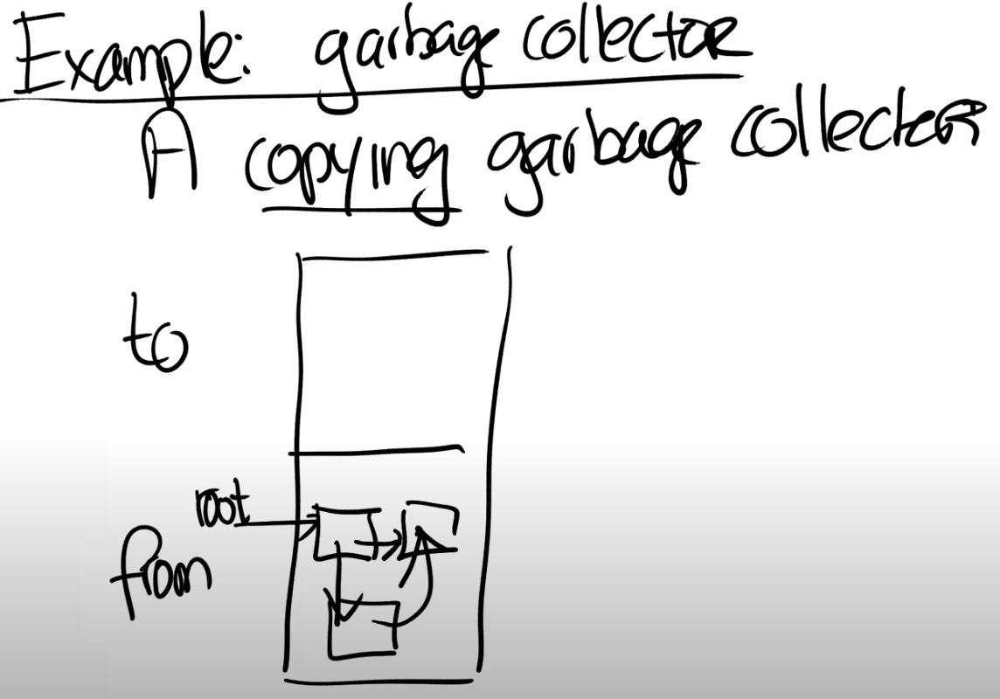

# 17.5 Baker's Real-Time Copying Garbage Collector

接下来我会讨论另一个例子，也就是Garbage Collector（注，后面将Garbage Collector和Garbage Collection都简称为GC），并且我也收到了很多有关Garbage Collector的问题。

GC是指编程语言替程序员完成内存释放，这样程序员就不用像在C语言中一样调用free来释放内存。对于拥有GC的编程语言，程序员只需要调用类似malloc的函数来申请内存，但是又不需要担心释放内存的过程。GC会决定内存是否还在使用，如果内存并没有被使用，那么GC会释放内存。GC是一个很好的特性，有哪些编程语言带有GC呢？Java，Python，Golang，几乎除了C和Rust，其他所有的编程语言都带有GC。

你可以想象，GC有很大的设计空间。这节课讨论的论文并没有说什么样的GC是最好的，它只是展示了GC可以利用用户空间虚拟内存特性。论文中讨论了一种特定的GC，这是一种copying GC。什么是copying GC？假设你有一段内存作为heap，应用程序从其中申请内存。你将这段内存分为两个空间，其中一个是from空间，另一个是to空间。当程序刚刚启动的时候，所有的内存都是空闲的，应用程序会从from空间申请内存。假设我们申请了一个类似树的数据结构。树的根节点中包含了一个指针指向另一个对象，这个对象和根节点又都包含了一个指针指向第三个对象，这里构成了一个循环。

