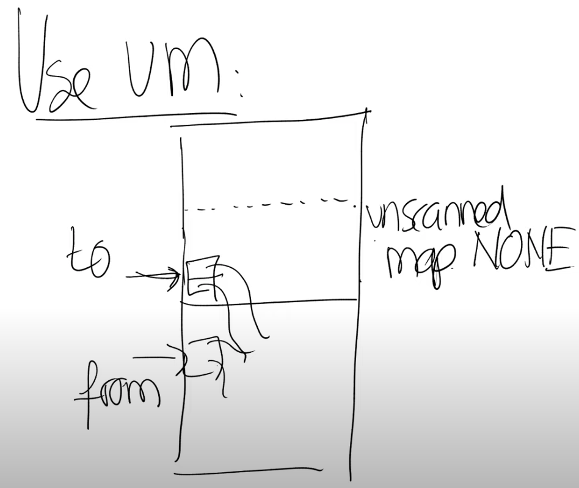

# 17.6 使用虚拟内存特性的GC

论文中介绍，如果拥有了前面提到的虚拟内存特性，你可以使用虚拟内存来减少指针检查的损耗，并且以几乎零成本的代价来并行运行GC。这里的基本思想是将heap内存中from和to空间，再做一次划分，每一个部分包含scanned，unscanned两个区域。在程序启动，或者刚刚完成了from和to空间的切换时，整个空间都是unscanned，因为其中还没有任何对象。

之后的过程与前面描述的相同，在开始GC时，我们将根节点对象拷贝到to空间，但是根节点中的指针还是指向了位于from空间的对象。现在unscanned区域包括了所有的对象（注，现在只有根节点），我们会将unscanned区域的权限设置为None。这意味着，当开始GC之后，应用程序第一次使用根节点，它会得到Page Fault，因为这部分内存的权限为None。

