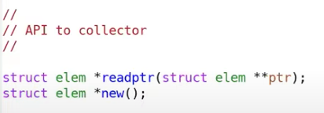
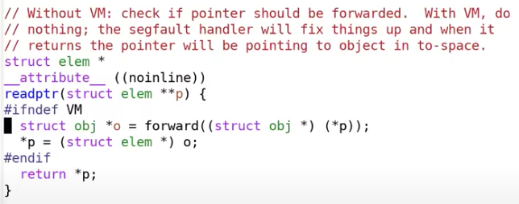

# 17.7 使用虚拟内存特性的GC代码展示

为了更清晰的说明上一节的内容，我这里有个针对论文中方法的简单实现，我可以肯定它包含了一些bug，因为我并没有认真的测试它。

首先，应用程序使用的API包括了new和readptr。

创建一个Share-memory object，shm\_open是一个Linux/Uinx系统调用。Share-memory object表现的像是一个文件，但是它并不是一个文件，它位于内存，并没有磁盘文件与之对应，如果你愿意的话，可以认为它是一个位于内存的文件系统。

之后我们裁剪这个Shared-memory object到from和to空间的大小。

之后我们通过mmap先将其映射一次，以供mutator也就是实际的应用程序使用。然后再映射一次，以供GC使用。这里shm\_open，ftruncate，和两次mmap，等效于map2。

回过去看之前的代码，

