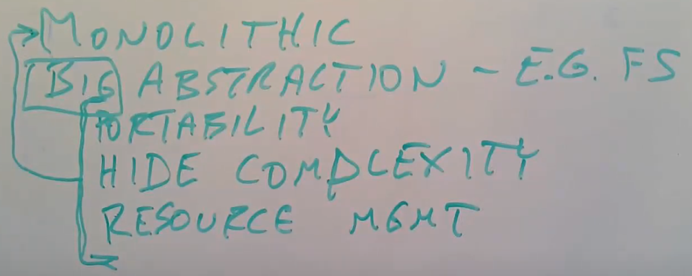

# 18.1 Monolithic kernel

今天我主要会讨论微内核（Mircro kernel）。

我们来看一下为什么人们会研究微内核？微内核是人们在思考操作系统内核应该做什么事情的过程中设计出来的。比如说XV6是一个Unix系统，它按照Unix风格提供了各种功能，并提供了Unix系统调用。实现一个Unix系统就是我们设计XV6的目标。但是一个完全值得思考的问题是，一个操作系统内核本身应该具备什么功能？或许XV6和Linux具备的功能并不是一个完美操作系统应该有的功能，又或许是呢。我们现在正在讨论一个变化莫测的问题，内核可以看做是一种程序员的开发平台，而我们知道不同的程序员对于他们喜欢的开发平台有着非常不同的主观喜好，所以我们不能期望这个问题有一个完美的答案。但是我们可以仍然可以期望从思考这个问题的过程中学到一些东西，并且尝试想一下答案可能是什么。

首先，让我说明一下操作系统的传统实现方式以及应该具备的功能。我个人将Linux，Unix，XV6称为用传统方式实现的操作系统。另一个形容这些操作系统的词是monolithic。monolithic的意思是指操作系统内核是一个完成了各种事情的大的程序。实际上，这也反应了人们觉得内核应该具备什么样的功能。类似于Linux的典型操作系统内核提供了功能强大的抽象。它们选择提供例如文件系统这样一个极其复杂的组件，并且将文件，目录，文件描述符作为文件系统的接口，而不是直接将磁盘硬件作为接口暴露给应用程序。monolithic kernel通常拥有例如文件系统这样强大的抽象概念，这比提供一些简单的抽象有着巨大的优势。

* 其中一个好处是，这些高度抽象的接口通常是可移植的，你可以在各种各样的存储上实现文件和目录，你可以使用文件和目录而不用担心它们是运行在什么牌子的磁盘，什么类型的存储之上，或许是SSD，或许是HDD，或许是NFS，但是因为文件系统接口是高度抽象的，所以它们都拥有相同的接口。所以这里的一个好处是可以获取可移植性。你可以在不修改应用程序的前提下，将其运行在各种各样的硬件之上。
* 另一个例子是，Linux/Unix提供地址空间的抽象而不是直接访问MMU硬件的权限。这不仅可以提供可移植性，并且也可以向应用程序隐藏复杂性。所以操作系统具备强大抽象的另一个好处是，它们可以向应用程序隐藏复杂性。举个例子，XV6提供的文件描述符非常简单，你只需要对文件描述符调用read/write就可以，但是在XV6内核中是非常复杂的代码来实现读写磁盘上的文件系统。这对于程序员是极好的，但是内核却因此变得又大又复杂。
* 这里的强大的抽象还可以帮助管理共享资源。例如我们将内存管理委托给了内核，内核会跟踪哪些内存是空闲的。类似的，内核还会跟踪磁盘的哪个部分是空闲的，磁盘的哪个部分正在被使用，这样应用程序就不用考虑这些问题，所以这可以帮助简化应用程序。同时也可以提供健壮性和安全性，因为如果允许应用程序决定磁盘的某个位置是否是空闲的，那么应用程序或许可以使用一个已经被其他应用程序使用的磁盘位置。所以，内核管理硬件资源可以提供资源共享能力和安全性。但是同样的，这也使得内核变得更大。内核提供的这些诱人的抽象能力，使得内核包含了很多的复杂性，进而导致内核很大且复杂。

