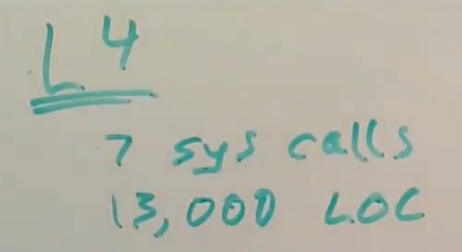

# 18.4 L4 micro kernel

今天要讨论的[论文](https://pdos.csail.mit.edu/6.828/2020/readings/microkernel.pdf)，有许多有关L4微内核的内容。这是今天论文作者开发和使用的一种微内核。L4必然不是最早的微内核，但是从1980年代开始，它是最早一批可以工作的微内核之一，并且它非常能展现微内核是如何工作的。在许多年里面它一直都有活跃的开发和演进。如果你查看Wikipedia，L4有15-20个变种，有一些从1980年代开始开发的项目现在还存在。接下来我将从我的理解向你们解释L4在今天的论文发表的时候是如何工作的。

首先，L4是微内核，它只有7个系统调用，虽然其中有一些稍微有点复杂，但是它还是只有7个系统调用。然而现在的Linux，我上次数了下有大概350个系统调用。甚至XV6这个极其简单的内核，也有21个系统调用。从这个指标来看，L4更加简单。

其次，L4并不大，论文发表的时候，它只有13000行代码，这并不多。XV6的代码更少，我认为XV6内核只有6000-7000行代码，所以作为内核XV6非常的简单。L4也没有复杂太多，它只有Linux代码的几十分之一，所以它非常的小。

