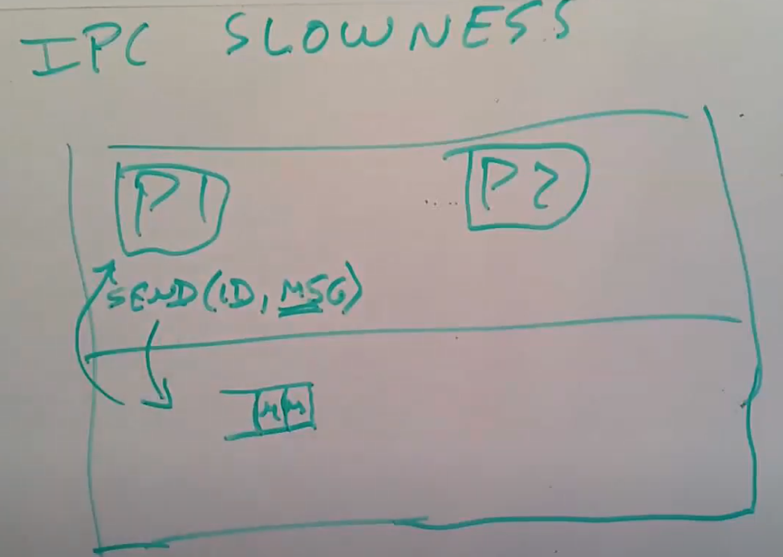
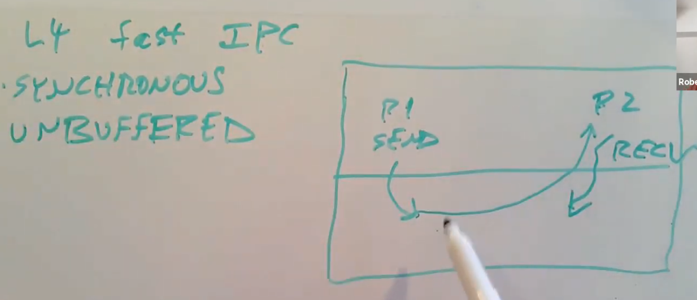

# 18.5 Improving IPC by Kernel Design

接下来我们讨论微内核里面一个非常重要的问题：IPC的速度。首先让我展示一个非常简单，但是也非常慢的设计。这个设计基于Unix Pipe。我之所以介绍这种方法，是因为一些早期的微内核以一种类似的方式实现的IPC，而这种方式实际上很慢。

假设我们有两个进程，P1和P2，P1想要给P2发送消息。这里该怎么工作呢？一种可能是使用send系统调用，传入你想将消息发送到的线程的ID，以及你想发送消息的指针。这个系统调用会跳到内核中，假设我们是基于XV6的pipe来实现，那么这里会有一个缓存。或许P2正在做一些其他的事情，并没有准备好处理P1的消息，所以消息会被先送到内核的缓存中。所以当你调用send系统调用，它会将你的消息追加到一个缓存中等待P2来接收它。在实际中，几乎很少情况你会只想要发送一个消息，你几乎总是想要能再得到一个回复。所以P1在调用完send系统调用之后，会立即调用recv来获取回复。但是现在让我们先假设我们发送的就是单向的IPC消息，send会将你的消息追加到位于内核的缓存中，我们需要从用户空间将消息逐字节地拷贝到内核的缓存中。之后再返回，这样P1可以做一些其他的事情，或许是做好准备去接受回复消息。

，这篇论文在今天要讨论的论文前几年发布。相比上面的慢设计，它有几点不同：

* 其中一点是，它是同步的（Synchronized）。所以这里不会丢下消息并等待另一个进程去获取消息，这里的send会等待消息被接收，并且recv会等待回复消息被发送。如果我是进程P1，我想要发送消息，我会调用send。send并不会拷贝我的消息到内核的缓存中，P1的send会等待P2调用recv。P2要么已经在内核中等待接收消息，要么P1的send就要等P2下一次调用recv。当P1和P2都到达了内核中，也就是P1因为调用send进入内核，P2因为调用recv进入内核，这时才会发生一些事情。这种方式快的一个原因是，如果P2已经在recv中，P1在内核中执行send可以直接跳回到P2的用户空间，从P2的角度来看，就像是从recv中返回一样，这样就不需要context switching或者线程调度。相比保存寄存器，出让CPU，通过线程调度找到一个新的进程来运行，这是一种快得多的方式。P1的send知道有一个正在等待的recv，它会立即跳转到P2，就像P2从自己的recv系统调用返回一样。这种方式也被称为unbuffered。它不需要buffer一部分原因是因为它是同步的。

