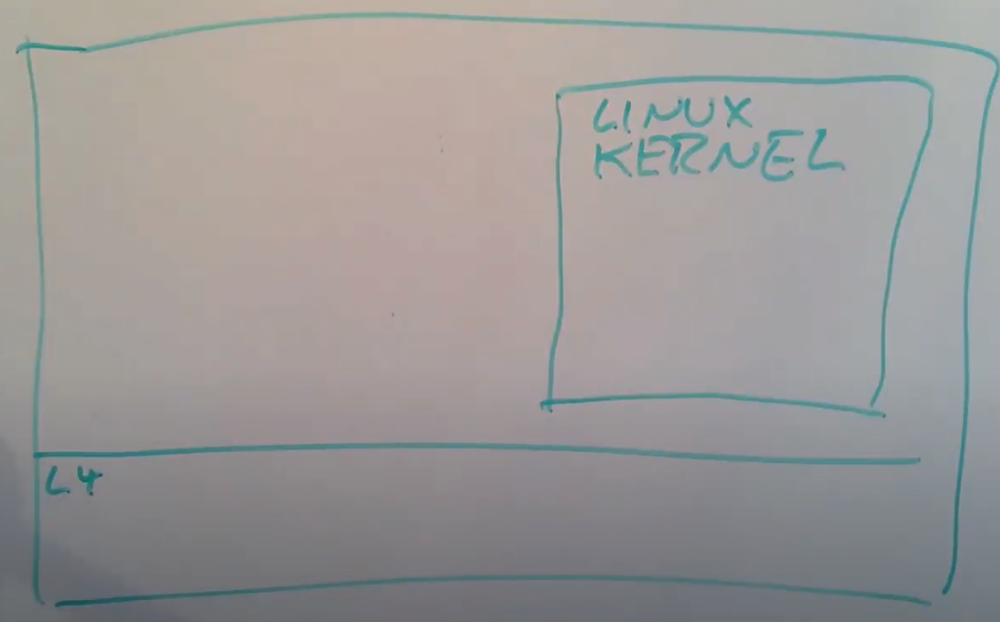

# 18.6 Run Linux on top of L4 micro kernel

前一节对于IPC的优化使得人们开始认真考虑使用微内核替代monolithic kernel。然而，这里仍然有个问题，即使IPC很快了，操作系统的剩余部分从哪里去获取？现在的微内核大概只有一个完整操作系统的百分之几，我们该怎么处理操作系统剩下的部分？这个问题通常会在一些有着相对较少资源的学校研究项目中被问到，我们需要从某个地方获取到所有这些用户空间服务。

实际上在一些特殊的应用场合，以上的问题并不是问题，比如说我们运行的一些设备的控制器，例如车里的点火控制器，只运行了几千行代码，它并且不需要一个文件系统，这样我们就只需要很少的用户空间内容，微内核也特别适合这种应用程序。但是微内核项目发起时，人们非常有雄心壮志，人们想的是完全替换操作系统，人们希望可以构建一些运行在工作站，服务器等各种地方的微内核操作系统，并取代大的monolithic kernel。对于这种场景，你需要一个传统操作系统所需要的所有内容。

一种可能是，重新以微内核的方式，以大量的进程实现所有的内容。实际上有项目在这么做，但是这涉及到大量的工作。具体的说，比如我想要使用笔记本电脑，我的电脑必须要有emacs和我最喜欢的C编译器，否则我肯定不会用你的操作系统。这意味着，微内核要想获得使用，它必须支持现有的应用程序，它必须兼容或者提供相同的系统调用或者更高层的服务接口，它必须能够完全兼容一些现有的操作系统，例如Unix，Linux，这样人们才愿意切换到微内核。所以这些微内核项目都面临一个具体的问题，它们怎么兼容一些为Linux，Windows写的应用程序？对于论文中提到的项目，也就是L4，对标的是Linux。与其写一些完全属于自己的新的用户空间服务，并模仿Linux，论文中决定采用一种容易的多的方法，其实许多项目也都采用了这种方法，也就是简单的将一个现有的monolithic kernel运行在微内核之上，而不是重新实现一些新的东西。这就是今天论文要介绍的内容。

在今天[论文](https://pdos.csail.mit.edu/6.828/2020/readings/microkernel.pdf)的讨论中，L4微内核位于底部，但是同时，一个完整的Linux作为一个巨大的服务运行在用户空间进程中。听起来有点奇怪，一般的kernel都是运行在硬件之上，而现在Linux kernel是一个用户空间进程。

