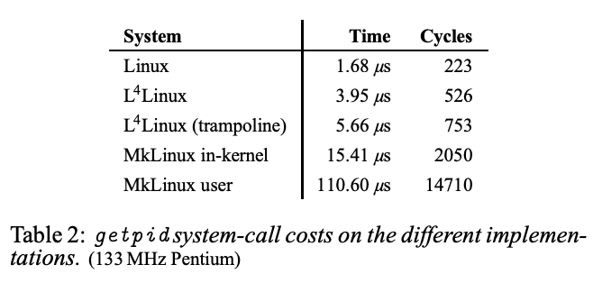

# 18.7 L4 Linux性能分析

你应该问自己：通过[论文](https://pdos.csail.mit.edu/6.828/2020/readings/microkernel.pdf)可以学到有关微内核的什么内容呢？

对于我们来说，论文中有很多有趣的有关微内核是如何运行，有关Linux是如何运行的小的知识点，以及你该如何设计这么一个系统。但是论文并没有回答这个问题：微内核是不是一个好的设计？论文只是讨论了微内核是否有足够的性能以值得使用。

论文之所以讨论这个内容的原因是，在论文发表的前5-10年，有一场著名的测试针对一种更早的叫做MACH的微内核。它也运行了与L4类似的结构，但是内部的设计完全不一样。通过测试发现，当按照前一节的架构运行时，MACH明显慢于普通的Unix。这里有很多原因，比如IPC系统并没有如你期望的一样被优化，这样会有更多的用户空间和内核空间的转换，cache-miss等等。有很多原因使得MACH很慢。但是很多人并不关心原因，只是看到了这个测试结果，发现MACH慢于原生的操作系统，并坚信微内核是无可救药的低效，几乎不可能足够快且足够有竞争力。很多人相信应该都使用monolithic kernel。

今天的论文像是对于这种观点的一个反驳，论文中的观点是，你可以构建类似上一节的架构，如果你花费足够的精力去优化性能，你可以获取与原生操作系统相比差不多的性能。因此，你不能只是因为性能就忽视微内核。今天的论文要说明的是，你可以因为其他原因不喜欢微内核，但是你不能使用性能作为拒绝微内核的原因。

达成这一点的一个重要部分是，IPC被优化的快得多了，相应的技术在18.5中提到过。

