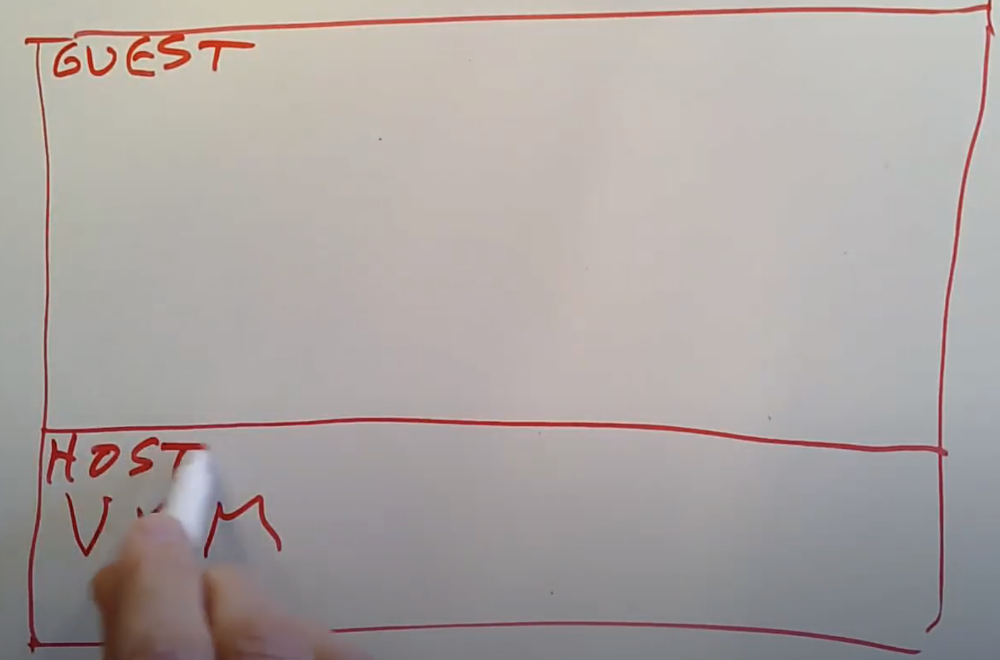

# 19.1 Why Virtual Machine?

今天讨论的话题是虚拟机。今天的内容包含三个部分:

* 第一个部分是Trap and Emulate，这部分会介绍如何在RISC-V或者QEMU上构建属于自己的Virtual Machine Monitor（注，有些场合也称为Hypervisor）。
* 第二部分会描述最近在硬件上对于虚拟化的支持。
* 最后是讨论一下今天的[论文](https://pdos.csail.mit.edu/6.828/2020/readings/belay-dune.pdf)，它使用了第二部分中硬件上的支持。

首先什么是虚拟机？你可以认为这是对于计算机的一种模拟，这种模拟足够能运行一个操作系统。QEMU可以认为是虚拟机的一个例子（注，QEMU应该是属于VMM/Hypervisor）。

在架构的最底层，位于硬件之上存在一个Virtual Machine Monitor（VMM），它取代了标准的操作系统内核。VMM的工作是模拟多个计算机用来运行Guest操作系统。VMM往上一层，如果对比一个操作系统的架构应该是用户空间，但是现在是叫做Guest空间。所以在今天的架构图里面，上面是Guest空间，下面是Host空间（注，也就是上面运行Guest操作系统，下面运行VMM）。

