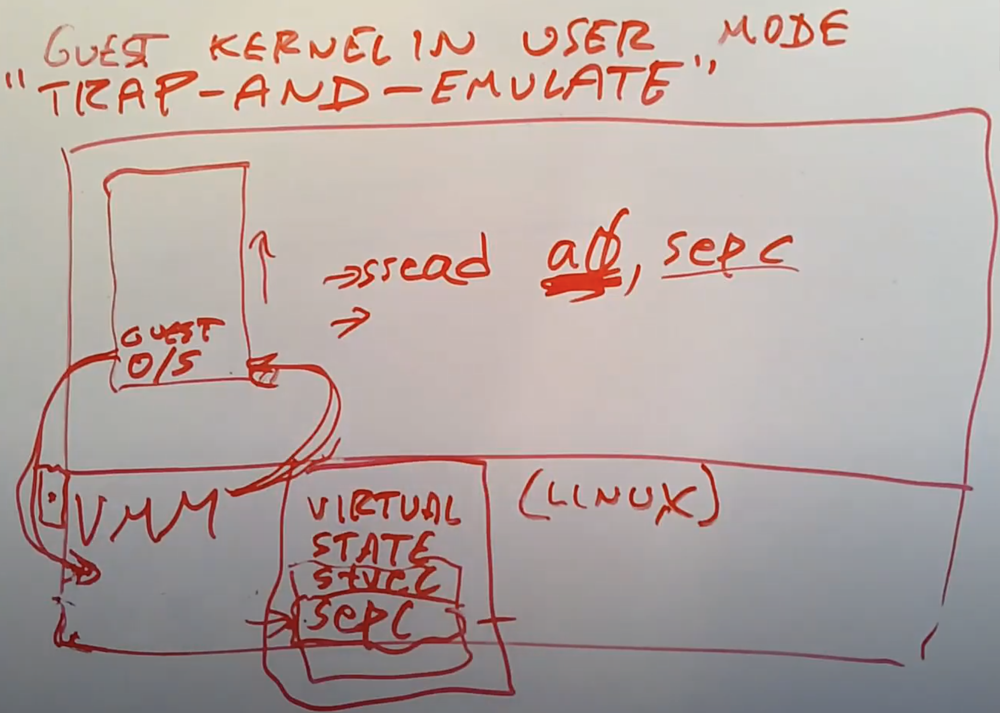

# 19.3 Trap-and-Emulate --- Emulate

VMM会为每一个Guest维护一套虚拟状态信息。所以VMM里面会维护虚拟的STVEC寄存器，虚拟的SEPC寄存器以及其他所有的privileged寄存器。当Guest操作系统运行指令需要读取某个privileged寄存器时，首先会通过trap走到VMM，因为在用户空间读取privileged寄存器是非法的。之后VMM会检查这条指令并发现这是一个比如说读取SEPC寄存器的指令，之后VMM会模拟这条指令，并将自己维护的虚拟SEPC寄存器，拷贝到trapframe的用户寄存器中（注，有关trapframe详见Lec06，这里假设Guest操作系统通过类似“sread a0, sepc”的指令想要将spec读取到用户寄存器a0）。之后，VMM会将trapframe中保存的用户寄存器拷贝回真正的用户寄存器，通过sret指令，使得Guest从trap中返回。这时，用户寄存器a0里面保存的就是SEPC寄存器的值了，之后Guest操作系统会继续执行指令。最终，Guest读到了VMM替自己保管的虚拟SEPC寄存器。

