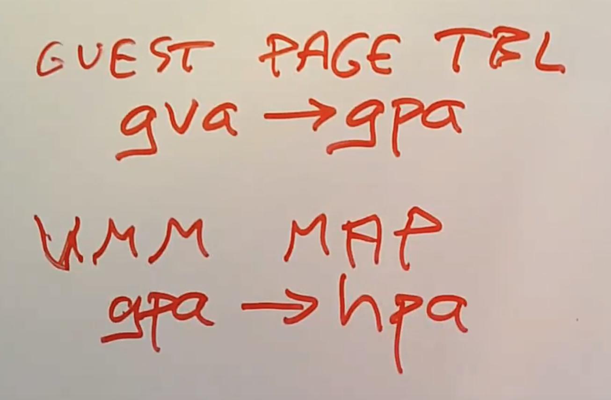

# 19.4 Trap-and-Emulate --- Page Table

有关Trap and Emulate的实现还有两个重要的部分，一个是Page Table，另一个是外部设备。

Page Table包含了两个部分，第一个部分是Guest操作系统在很多时候会修改SATP寄存器（注，SATP寄存器是物理内存中包含了Page Table的地址，详见4.3），当然这会变成一个trap走到VMM，之后VMM可以接管。但是我们不想让VMM只是简单的替Guest设置真实的SATP寄存器，因为这样的话Guest就可以访问任意的内存地址，而不只是VMM分配给它的内存地址，所以我们不能让Guest操作系统简单的设置SATP寄存器。

但是我们的确又需要为SATP寄存器做点什么，因为我们需要让Guest操作系统觉得Page Table被更新了。此外，当Guest上的软件运行了load或者store指令时，或者获取程序指令来执行时，我们需要数据或者指令来自于内存的正确位置，也就是Guest操作系统认为其PTE指向的内存位置。所以当Guest设置SATP寄存器时，真实的过程是，我们不能直接使用Guest操作系统的Page Table，VMM会生成一个新的Page Table来模拟Guest操作系统想要的Page Table。

所以现在的Page Table翻译过程略微有点不一样，首先是Guest kernel包含了Page Table，但是这里是将Guest中的虚拟内存地址（注，下图中gva）映射到了Guest的物理内存地址（注，下图中gpa）。Guest物理地址是VMM分配给Guest的地址空间，例如32GB。并且VMM会告诉Guest这段内存地址从0开始，并一直上涨到32GB。但是在真实硬件上，这部分内存并不是连续的。所以我们不能直接使用Guest物理地址，因为它们不对应真实的物理内存地址。

相应的，VMM会为每个虚拟机维护一个映射表，将Guest物理内存地址映射到真实的物理内存地址，我们称之为主机物理内存地址（注，下图中的hpa）。这个映射表与Page Table类似，对于每个VMM分配给Guest的Guest物理内存Page，都有一条记录表明真实的物理内存Page是什么。

