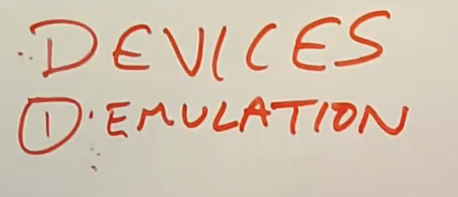

# 19.5 Trap-and-Emulate --- Devices

接下来我们来看Trap and Emulate的最后一个部分，也就是虚拟机的外部设备。外部设备是指，一个普通的操作系统期望能有一个磁盘用来存储文件系统，或者是期望有一个网卡，甚至对于XV6来说期望有一个UART设备来与console交互，或者期望有一张声卡，一个显卡，键盘鼠标等等各种各样的东西。所以我们我们的虚拟机方案，需要能够至少使得Guest认为所有它需要的外部设备是存在的。

这里人们通常会使用三种策略。

第一种是，模拟一些需要用到的并且使用非常广泛的设备，例如磁盘。也就是说，Guest并不是拥有一个真正的磁盘设备，只是VMM使得与Guest交互的磁盘看起来好像真的存在一样。这里的实现方式是，Guest操作系统仍然会像与真实硬件设备交互一样，通过Memory Map控制寄存器与设备进行交互。通常来说，操作系统会假设硬件已经将自己的控制寄存器映射到了内核地址空间的某个地址上。在VMM中不会映射这些内存地址对应的Page，相应的会将这些Page设置成无效。这样当Guest操作系统尝试使用UART或者其他硬件时，一访问这些地址就会通过trap走到VMM。VMM查看指令并发现Guest正在尝试在UART发送字符或者从磁盘中读取数据。VMM中会对磁盘或者串口设备有一些模拟，通过这些模拟，VMM知道如何响应Guest的指令，之后再恢复Guest的执行。这就是我们之前基于QEMU介绍XV6时，QEMU实现UART的方式。在之前的介绍中，并没有UART硬件的存在，但是QEMU模拟了一个UART来使得XV6正常工作。这是一种常见的实现方式，但是这种方式可能会非常的低效，因为每一次Guest与外设硬件的交互，都会触发一个trap。但是对于一些低速场景，这种方式工作的较好。如果你的目标就是能启动操作系统并使得它们完全不知道自己运行在虚拟机上，你只能使用这种策略。

