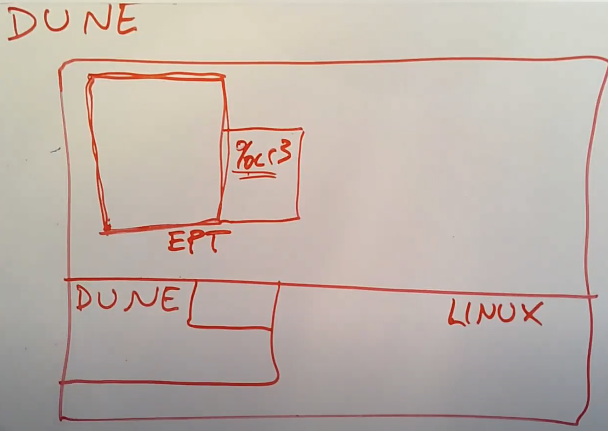

# 19.7 Dune: Safe User-level Access to Privileged CPU Features

今天要讨论的[论文](https://pdos.csail.mit.edu/6.828/2020/readings/belay-dune.pdf)利用了上一节介绍的硬件对于虚拟机的支持，但是却将其用作其他的用途，这是这篇论文的有趣之处，它利用了这种完全是为了虚拟机而设计的硬件，但是却用来做一些与虚拟机完全无关的事情。从一个全局的视角来看这篇论文的内容，它想要实现的是普通的进程。所以现在我们的场景是在一个Linux而不是VMM中，但是我们又用到了硬件中的VT-x。我们将会在Linux中加载Dune可加载模块，所以Dune作为kernel的一部分运行在Supervisor mode（注，又或者叫做kernel mode），除此之外，内核的大部分还是原本的Linux。

因为这里运行的是Linux进程，所以我们期望Dune可以支持进程，以及包括系统调用在内的各种Linux进程可以做的事情。不过现在我们想要使用VT-x硬件来使得普通的Linux进程可以做一些额外的事情。Dune会运行一些进程，或者说允许一个进程切换到Dune模式，这意味着，之前的进程只是被Page Table保护和隔离，现在这个进程完全被VT-x机制隔离开了。现在进程有了一套完整的虚拟控制寄存器，例如CR3寄存器，并且这些进程可以运行在non-root Supervisor mode，所以它可以在VT-x管理的虚拟状态信息上直接执行所有的privileged指令。

基于上面的描述，Dune管理的进程可以通过属于自己的CR3寄存器，设置好属于自己的Page Table。当然Dune也会控制属于这个进程的EPT，EPT会被设置的只包含这个进程相关的内存Page。所以进程可以向CR3寄存器写入任意的Page Table地址，但是因为MMU会在翻译完正常的Page Table之后再将地址送到EPT去翻译，所以进程不能从分配给它的内存中逃逸。所以进程并不能修改其他进程或者kernel的内存，它只是有了一种更灵活的设置自己内存的方式。

