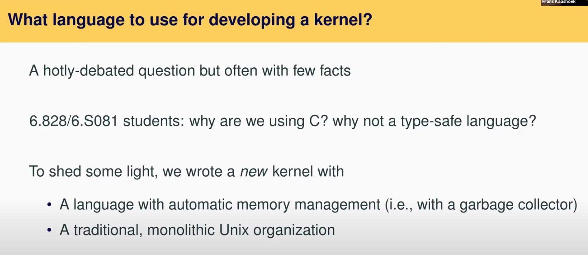
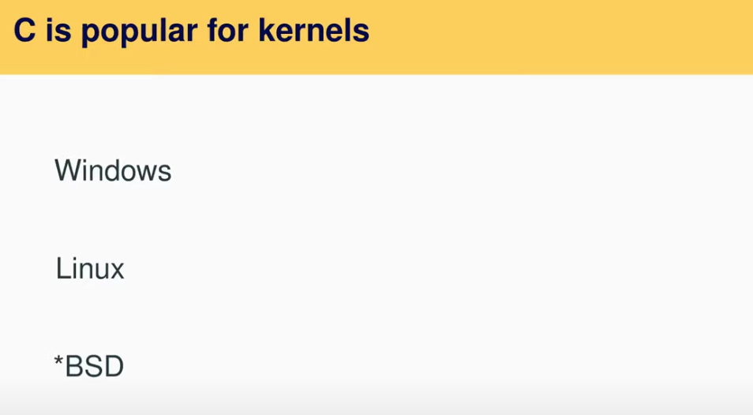

# 20.1 C语言实现操作系统的优劣势

今天我们要讨论使用高级编程语言实现操作系统的优点和代价。今天课程的内容主要是我们之前写的一篇[论文](https://pdos.csail.mit.edu/6.828/2020/readings/biscuit.pdf)，论文作者包括了Robert和我，以及一个主要作者Cody Cutler，他是这门课程的一个TA。我通常不会讨论我们自己写的论文，但是因为这篇论文与课程内容相关，所以它在这。今天我们会用一些PPT，而不是在白板上讲解这节课。

算法和O(n)的查找，如果你想要写一个高性能的操作系统，你不能有这样的实现。以上就是论文的起因，以及我们创建Biscuit（也就是上面提到的操作系统）的原因，我们想要回答上面的问题，或者至少给出一些启发。

今天这节课首先我要讨论一些通用的背景，之后我们会深入到Biscuit的细节中。

