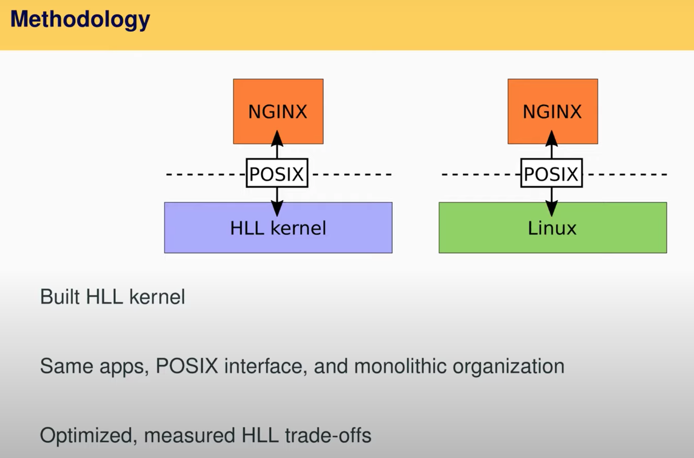
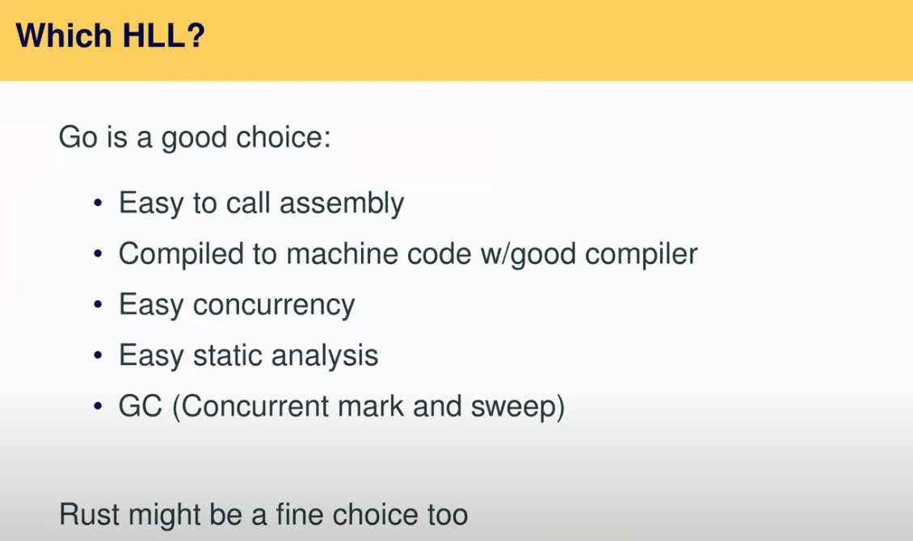

# 20.3 高级编程语言选择 --- Golang

专门用Golang写的内核，它以大概类似的方式提供了Linux中系统调用的子集。Biscuit和Linux的系统调用有相同的参数和相同的调用方式。并且我们在内核之上运行的是相同的应用程序，这里的应用程序是NGINX，这是一个web server，这里我们将相同的应用程序分别运行在Biscuit和Linux之上，应用程序会执行相同的系统调用，并传入完全相同的参数，Biscuit和Linux都会完成涉及系统调用的相同操作。之后，我们就可以研究高级编程语言内核和Linux之间的区别，并讨论优劣势是什么。以上就是对比方法的核心。

因为Linux和Biscuit并不完全一样，它们会有一些差异，所以我们花费了大量的时间来使得这里的对比尽可能得公平。

