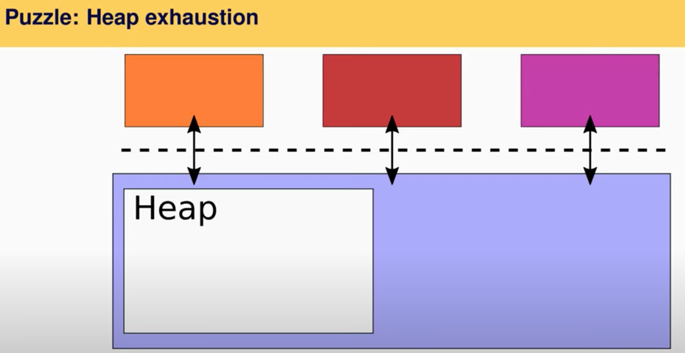

# 20.5 Heap exhaustion

让我们讨论一下Heap耗尽问题，我不会像[论文](https://pdos.csail.mit.edu/6.828/2020/readings/biscuit.pdf)一样深入讨论，但是至少会演示问题是什么。

 (1).png>)

* 第一种方法我们在XV6中见过。如果XV6不能找到一个空闲的block cache来保存disk block，它会直接panic。这明显不是一个理想的解决方案。这并不是一个实际的解决方案，所以我们称之为strawman。
* 另一个strawman方法是，当你在申请一块新的内存时，你会调用alloc或者new来分配内存，你实际上可以在内存分配器中进行等待。这实际上也不是一个好的方案，原因是你可能会有死锁。假设内核有把大锁，当你调用malloc，因为没有空闲内存你会在内存分配器中等待，那么这时其他进程都不能运行了。因为当下一个进程想要释放一些内存时，但是因为死锁也不能释放。对于内核中有大锁的情况，这里明显有问题，但是即使你的锁很小，也很容易陷入到这种情况：在内存分配器中等待的进程持有了其他进程需要释放内存的锁，这就会导致死锁的问题。
* 下一个strawman方法是，如果没有内存了就返回空指针，你检查如果是空指针就直接失败，这被称为bail out。但是bail out并不是那么直观，进程或许已经申请了一些内存，那么你需要删除它们，你或许做了一部分磁盘操作，比如说你在一个多步的文件系统操作中间，你只做了其中的一部分，你需要回退。所以实际中非常难做对。

当研究这部分，并尝试解决这个问题，Linux使用了前面两种方法，但是两种方法都有问题。实际中，内核开发人员很难将这里弄清楚。如果你对这个问题和相关的讨论感兴趣，可以Google搜索“[too small to fail](https://lwn.net/Articles/627419/)”，会有一篇小的文章讨论释放内存，在内存分配器中等待的复杂性。

对于Biscuit来说，strawman 2解决方案不可能实施，因为new不会fail，它总是能成功。除此之外，这里的方案都不理想，所以我们需要有一种更好的方法。
