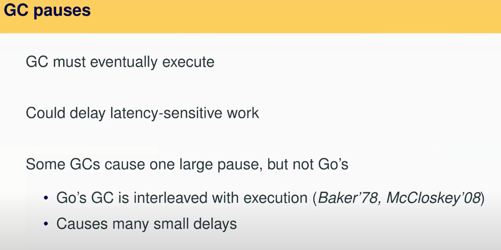
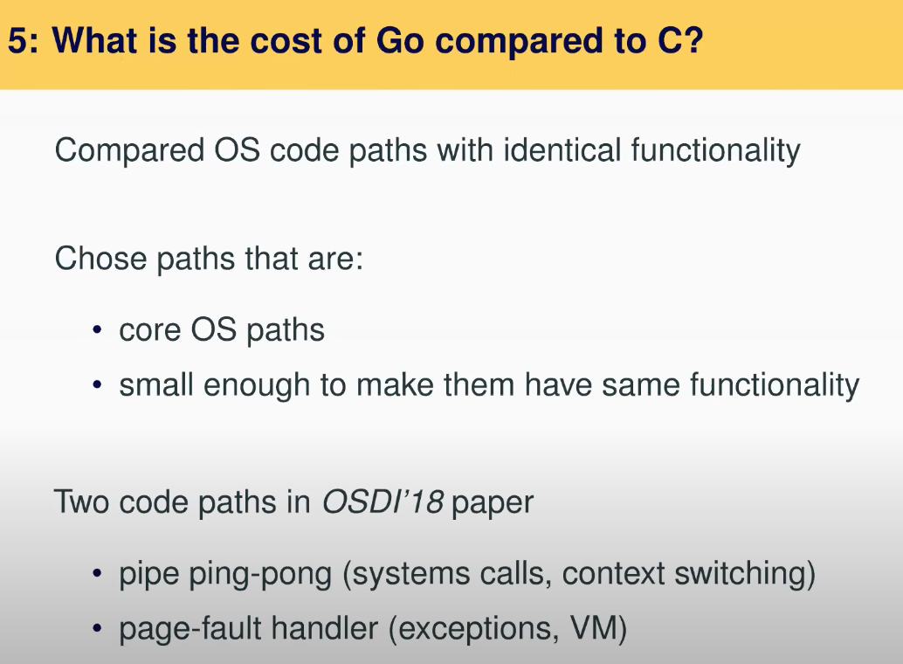

# 20.9 Evaluation: HLL performance cost(2)

，其中介绍有关一个请求最长可以有多长处理时间，他们讨论的都是几毫秒或者几十毫秒这个量级。所以Biscuit拥有最大pause时间是582微秒还在预算之内，虽然不理想，但是也不会很夸张。这表明了，Golang的设计人员把GC实现的太好了。并且我们在做Biscuit项目的时候发现，每次我们升级Go runtime，新的runtime都会带一个更好的GC，相应的GC pause时间也会变得更小。

