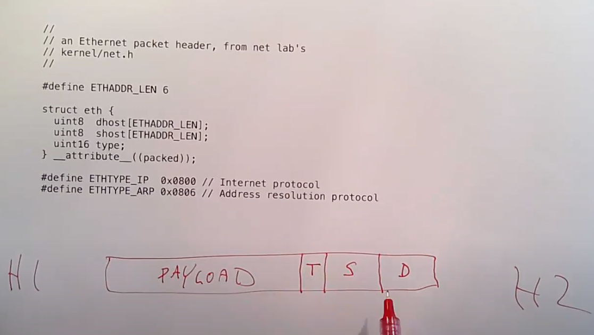

# 21.2 二层网络 --- Ethernet

让我从最底层开始，我们先来看一下一个以太网packet的结构是什么。当两个主机非常靠近时，或许是通过相同的线缆连接，或许连接在同一个wifi网络，或许连接到同一个以太网交换机。当局域网中的两个主机彼此间要通信时，最底层的协议是以太网协议。你可以认为Host1通过以太网将Frame发送给Host2。Frame是以太网中用来描述packet的单词，本质上这就是两个主机在以太网上传输的一个个的数据Byte。以太网协议会在Frame中放入足够的信息让主机能够识别彼此，并且识别这是不是发送给自己的Frame。每个以太网packet在最开始都有一个Header，其中包含了3个数据。Header之后才是payload数据。Header中的3个数据是：目的以太网地址，源以太网地址，以及packet的类型。

