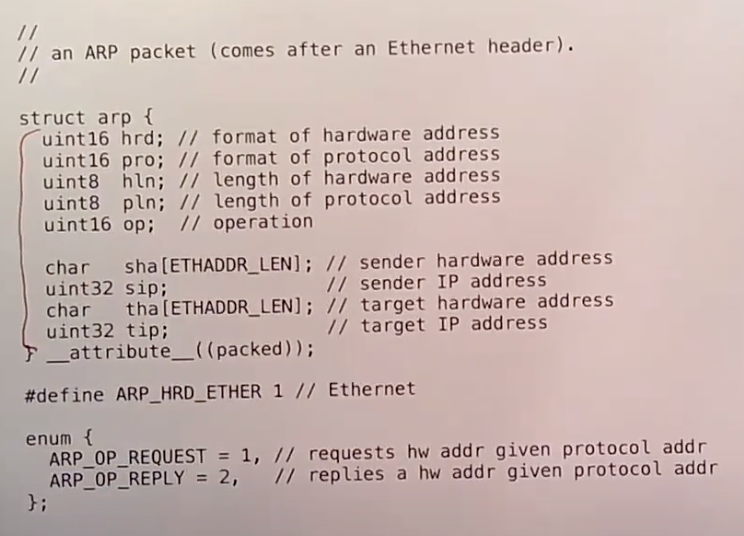

# 21.3 二/三层地址转换 --- ARP

下一个与以太网通信相关的协议是ARP。在以太网层面，每个主机都有一个以太网地址。但是为了能在互联网上通信，你需要有32bit的IP地址。为什么需要IP地址呢？因为IP地址有额外的含义。IP地址的高位bit包含了在整个互联网中，这个packet的目的地在哪。所以IP地址的高位bit对应的是网络号，虽然实际上要更复杂一些，但是你可以认为互联网上的每一个网络都有一个唯一的网络号。路由器会检查IP地址的高bit位，并决定将这个packet转发给互联网上的哪个路由器。IP地址的低bit位代表了在局域网中特定的主机。当一个经过互联网转发的packet到达了局域以太网，我们需要从32bit的IP地址，找到对应主机的48bit以太网地址。这里是通过一个动态解析协议完成的，也就是Address Resolution Protocol，ARP协议。

当一个packet到达路由器并且需要转发给同一个以太网中的另一个主机，或者一个主机将packet发送给同一个以太网中的另一个主机时，发送方首先会在局域网中广播一个ARP packet，来表示任何拥有了这个32bit的IP地址的主机，请将你的48bit以太网地址返回过来。如果相应的主机存在并且开机了，它会向发送方发送一个ARP response packet。

下图是一个ARP packet的格式：

