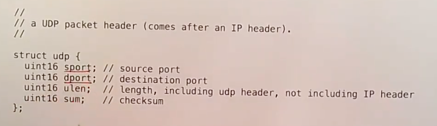

# 21.5 四层网络 --- UDP

IP header足够让一个packet传输到互联网上的任意一个主机，但是我们希望做的更好一些。每一个主机都运行了大量需要使用网络的应用程序，所以我们需要有一种方式能区分一个packet应该传递给目的主机的哪一个应用程序，而IP header明显不包含这种区分方式。有一些其他的协议完成了这里的区分工作，其中一个是TCP，它比较复杂，而另一个是UDP。TCP不仅帮助你将packet发送到了正确的应用程序，同时也包含了序列号等用来检测丢包并重传的功能，这样即使网络出现问题，数据也能完整有序的传输。相比之下，UDP就要简单的多，它以一种“尽力而为”的方式将packet发送到目的主机，除此之外不提供任何其他功能。

UDP header中最关键的两个字段是sport源端口和dport目的端口。

