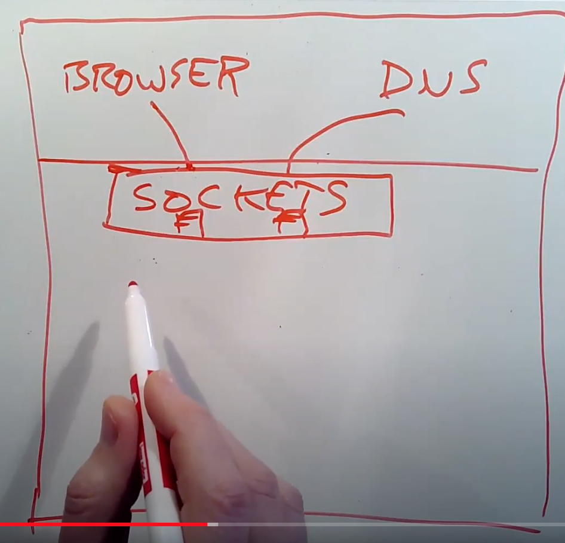

# 21.6 网络协议栈（Network Stack）

与packet的协议和格式对应的是运行在主机上的网络协议栈。人们有各种各样的方式来组织网络软件，接下来我会介绍最典型的，并且至少我认为是最标准的组织方式。

假设我们现在在运行Linux或者XV6，我们有一些应用程序比如浏览器，DNS服务器。这些应用程序使用socket API打开了socket layer的文件描述符。Socket layer是内核中的一层软件，它会维护一个表单来记录文件描述符和UDP/TCP端口号之间的关系。同时它也会为每个socket维护一个队列用来存储接收到的packet。我们在networking lab中提供的代码模板包含了一个非常原始的socket layer。

