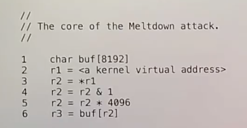

# 22.1 Meltdown发生的背景

今天讲的是Meltdown，之所以我会读这篇论文，是因为我们在讲解如何设计内核时总是会提到安全。内核提供安全性的方法是隔离，用户程序不能读取内核的数据，用户程序也不能读取其他用户程序的数据。我们在操作系统中用来实现隔离的具体技术是硬件中的User/Supervisor mode，硬件中的Page Table，以及精心设计的内核软件，例如系统调用在使用用户提供的指针具备防御性。

但是同时也值得思考，如何可以破坏安全性？实际上，内核非常积极的提供隔离性安全性，但总是会有问题出现。今天的[论文](https://pdos.csail.mit.edu/6.828/2020/readings/meltdown.pdf)讨论的就是最近在操作系统安全领域出现的最有趣的问题之一，它发表于2018年。包括我在内的很多人发现对于用户和内核之间的隔离进行攻击是非常令人烦恼的，因为它破坏了人们对于硬件上的Page Table能够提供隔离性的设想。这里的攻击完全不支持这样的设想。

同时，Meltdown也是被称为Micro-Architectural Attack的例子之一，这一类攻击涉及利用CPU内隐藏的实现细节。通常来说CPU如何工作是不公开的，但是人们会去猜，一旦猜对了CPU隐藏的实现细节，就可以成功的发起攻击。Meltdown是可被修复的，并且看起来已经被完全修复了。然后它使得人们担心还存在类似的Micro-Architectural Attack。所以这是最近发生的非常值得学习的一个事件。

让我从展示攻击的核心开始，之后我们再讨论具体发生了什么。

