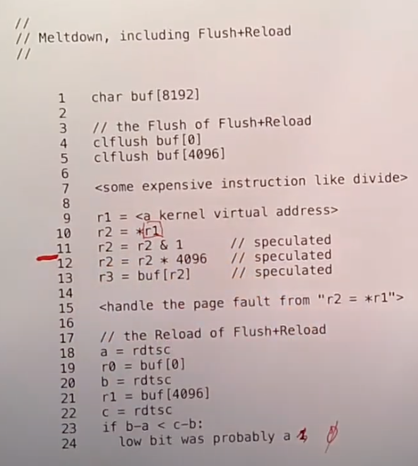

# 22.7 Meltdown Fix

我最后想讨论的是Meltdown的修复，你们实际已经接触了一些了。当[论文](https://pdos.csail.mit.edu/6.828/2020/readings/meltdown.pdf)发表的时候，它获取了很多的关注。实际中还有另一篇论文，也是由这篇论文的部分作者参与完成，另一篇论文讨论了一种使用了CPU内一种叫做Spectre的不同的预测执行的不同攻击方法。这一对论文的同时出现让人非常兴奋(￣▽￣)"。

所以人们现在发现危害太大了，因为现在我们讨论的是操作系统的隔离性被破坏了。这里的技术破坏了Page Table的保护，这是我们用来实现用户和内核间隔离的技术，所以这是一个非常基础的攻击，或者至少以一种非常通用的方式破坏了安全性非常重要的一个部分。所以人们非常非常迫切的想要修复Meltdown。

很多操作系统在这篇论文发表之后数周内就推出的一个快速修复，这是一个叫做KAISER，现在在Linux中被称为KPTI的技术（Kernel page-table isolation）。这里的想法很简单，也就是不将内核内存映射到用户的Page Table中，相应的就像XV6一样，在系统调用时切换Page Table。所以在用户空间时，Page Table只有用户内存地址的映射，如果执行了系统调用，会有类似于XV6中trampoline的机制，切换到拥有内核内存映射的另一个Page Table中，这样才能执行内核代码。

