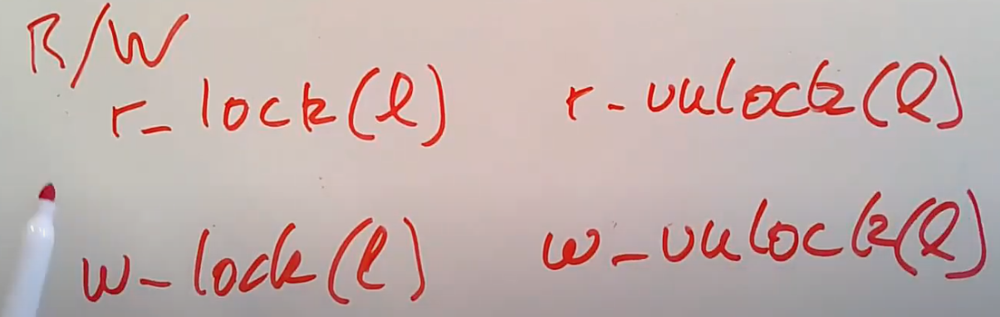
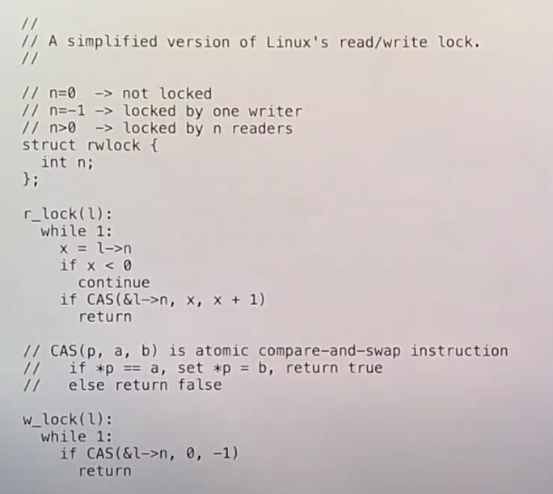
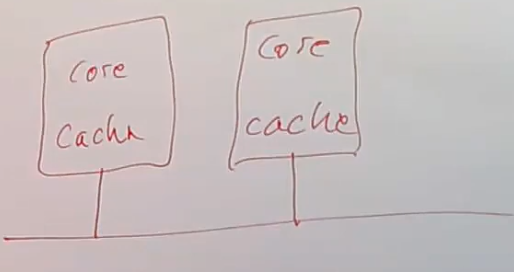
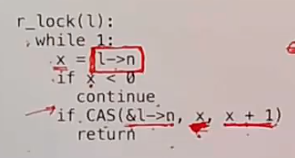

# 23.2 读写锁 (Read-Write Lock)

这种锁被称为读写锁（Read-Write Lock），它的接口相比spinlock略显复杂。如果只是想要读取数据，那么可以调用r\_lock，将锁作为参数传入，同样的还会有个r\_unlock，数据的读取者使用这些接口。数据的写入者调用w\_lock和w\_unlock接口。

。但实际上如果你深入细节，你会发现当你使用读写锁时，尤其对于大部分都是读取操作的数据结构，会有一些问题。为了了解实际发生了什么，我们必须看一下读写锁的代码实现。

 invalidation。

级别的CPU消息，因为至少每次循环中所有CPU对于l->n的cache需要被设置为无效。这意味着，对于n个CPU核来说，同时获取一个锁的成本是O(n^2)，当你为一份数据增加CPU核时，成本以平方增加。
>
> 这是一个非常糟糕的结果，因为你会期望如果有10个CPU核完成一件事情，你将获得10倍的性能，尤其现在还只是读数据并没有修改数据。你期望它们能真正的并行运行，当有多个CPU核时，每个CPU核读取数据的时间应该与只有一个CPU核时读取数据的时间一致，这样并行运行才有意义，因为这样你才能同时做多件事情。但是现在，越多的CPU核尝试读取数据，每个CPU核获取锁的成本就越高。
>
> 对于一个只读数据，如果数据只在CPU的cache中的话，它的访问成本可能只要几十个CPU cycle。但是如果数据很受欢迎，由于O(n^2)的效果，光是获取锁就要消耗数百甚至数千个CPU cycle，因为不同CPU修改数据（注，也就是读写锁的计数器）需要通过CPU之间的连线来完成缓存一致的操作。
>
> 所以这里的读写锁，将一个原本成本很低的读操作，因为要修改读写锁的l->n，变成了一个成本极高的操作。如果你要读取的数据本身就很简单，这里的锁可能会完全摧毁任何并行带来的可能的性能提升。

读写锁糟糕的性能是RCU存在的原因，因为如果读写锁足够有效，那么就没有必要做的更好。除了在有n个CPU核时，r\_lock的成本是O(n^2)之外，这里的读写锁将一个本来可以缓存在CPU中的，并且可能会很快的只读的操作，变成了需要修改锁的计数器l->n的操作。如果我们写的是可能与其他CPU核共享的数据，写操作通常会比读操作成本高得多。因为读一个未被修改的数据可以在几个CPU cycle内就从CPU cache中读到，但是修改可能被其他CPU核缓存的数据时，需要涉及CPU核之间的通信来使得缓存失效。不论如何修改数据结构，任何涉及到更改共享数据的操作对于性能来说都是灾难。

